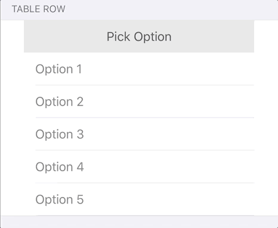
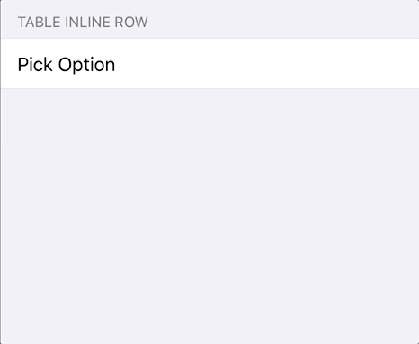

## Introduction

TableRow and TableInlineRow are custom rows for Eureka form library.
TableRow uses UITableView inside cell and allows to pick between multiple options.
TableInlineRow is InlineRow on top of TableRow.  



## Usage

Rows are generic, so different cases are possible

```swift
import Eureka
import TableRow

class ViewController: FormViewController {

    override func viewDidLoad() {
        super.viewDidLoad()

        form +++ Section()
			<<< TableRow<Int> { row in
				row.options = [1, 2, 3]
				row.displayValueFor = { "\($0 ?? 0)" }
			}
            <<< TableInlineRow<String> { row in
                row.options = ["first", second", "third"]
				row.value = "none"
            }
    }
}
```

## Requirements

* iOS 8.0+
* Xcode 9.0+
* Eureka 4.0

## Installation

#### CocoaPods

1. Add the following line to your Podfile:

	```ruby
	pod 'TableRow'
	```

2. Run `$ pod install`

#### Carthage

1. Add the following line to your Cartfile:

	```
	github "EurekaCommunity/TableRow"
	```

2. Run `$ carthage update`

3. Link `TableRow.framework` in your target, add it to `input files` list in Build Phases `Copy Frameworks` script

## Customization

#### TableRow

* `textColor` - provide default text color for underlying tableView cells  
* `horizontalContentInset` - provide content inset for cells to distinguish from other rows  
* `configureCell` callback - configure internal cell during cell dequeueing  
* `onDidSelect` callback - called every time internal cell selected

#### TableInlineRow

* `subcellTextColor, subcellHorizontalInset` - provide corresponding parameters for TableRow  
* `configureSubcell` callback - set `configureCell` callback fro TableRow
* `onToggleInlineRow` callback - optionally provide action depending on row toggled state

## Author

* [Anton Kovtun](https://github.com/loromits)
